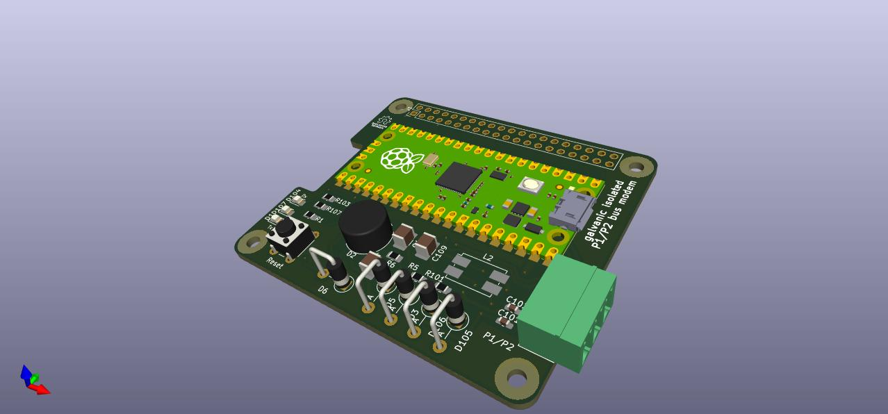
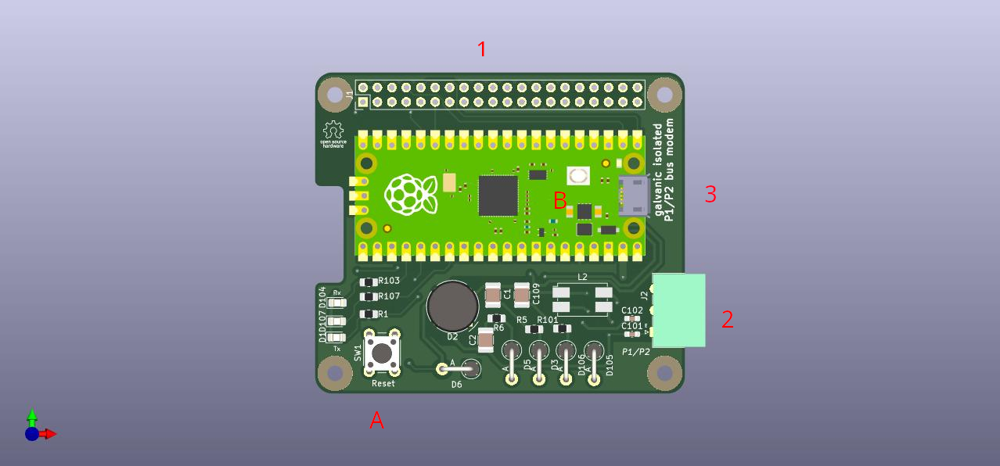

# Daikin P1/P2 Raspberry Pi hat

This project is about a Raspberry Pi hat/standalone interface to communicate
over the proprietary Daikin P1/P2 power-line bus.

Instead of a [MAX22088](https://www.analog.com/en/products/max22088.html)
it uses a [Raspberry Pi Pico](https://www.raspberrypi.com/products/raspberry-pi-pico/)
and [LM4871](https://www.ti.com/product/LM4871) audio amplifier as modem.

For more details on P1/P2 bus check out
[https://github.com/Arnold-n/P1P2Serial](https://github.com/Arnold-n/P1P2Serial).

It features:
- Galvanic isolation
- 115200baud ASCII [UART interface](pico/doc/uart.md)
- [3 Status LEDs](pico/doc/leds.md)
- Autonomous mode to emulate "External controller" on address F0h
- Bus idle/busy detection
- Collision detection on TX
- Easy to solder: [no QFN parts, only SOIC-8](kicad/doc/circuits.md)
- Cost around 20€ (PCB + parts)
- Raspberry Pi hat compatible (powered from +5V)
- Micro-USB for standalone mode (powered over USB)

The board can be powered over Micro-USB only and doesn't need a Raspberry Pi
baseboard. The communication then will be done over the virtual USB UART.

    This project is not an offical Daikin product. Use own your own risk!
    It has been tested on a Daikin EJHA04AAV3.

## Chapters

- [User handbook](doc/handbook.md)
- [The electronics in detail](kicad/doc/circuits.md)
- [Ti LM4871 vs STM TS4990](kicad/doc/clicks.md)
- [Emulating a differential ADC](pico/doc/ADC.md)
- [Protocol used by the UART](pico/doc/uart.md)
- [Decoding the LED status](pico/doc/leds.md)
- [Hardware off-load the P1/P2 encoding using PIO0](pico/doc/Pio0.md)
- [Hardware off-load inversing ADC channel1](pico/doc/Pio1.md)

## Sources

- The hardware can be found here: [kicad](./kicad)
- The software can be found here: [pico](./pico)
- The host software can be found here: [siro20/P1P2decoder](https://github.com/siro20/P1P2decoder)

## The hardware

There are 3 connectors on the Pi hat:
1. Rasperry Pi 40-pin header
  - Provides power
  - Connects to the UART on GPIO14/GPIO15
  - Connects CTS/RTS on GPIO16/GPIO17
  - Signals a bus collision on GPIO22
2. P1/P2 bus connector
 - P1
 - P2
 - Earth
3. Micro USB
 - Allows to update the Pico firmware
 - Powers the board when used in standalone mode

A. Reset button
B. Boot-mode button
   Hold button B and press button A to enter the
   Raspberry Pico USB bootloader.

## Disclaimer

    THE OPEN SOURCE SOFTWARE/HARDWARE IN THIS PROJECT IS DISTRIBUTED
    IN THE HOPE THAT IT WILL BE USEFUL, BUT WITHOUT ANY WARRANTY, WITHOUT
    EVEN THE IMPLIED WARRANTY OF MERCHANTABILITY OR FITNESS FOR A
    PARTICULAR PURPOSE.

    The "Daikin P1/P2 Raspberry Pi hat" has been designed and tested with
    Daikin's P1/P2 bus. You must not use this project to interface any
    other electrical bus.
