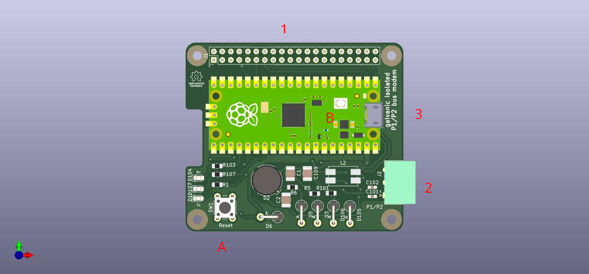

# User handbook

The "Daikin P1/P2 Raspberry Pi hat" can operate in two modes:
1. Standalone
2. RPi hat

In **Standalone mode** the board is powered over USB and the communication
is done over USB CDC.

In **RPi hat mode** the board is connected to a Raspberry Pi using the
40pin connector. You can optionally connect the USB cable, but ito's only
needed for updating the firmware using DCU mode. For normal operation the
USB cable is not required.



### Standalone mode


Connect P1, P2 (2) and Micro-USB (3) on the RPi Pico.

### RPi hat mode


Connect P1, P2 (2) and the 40pin pin-header (1).

## Flashing new firmware on the Pico

You need to connect the Micro-USB cable to use the USB mass storage
firmware update method.

1. Press the reset button (A) down and hold it.
2. Press the BOOTSEL button (B) on the Pico and hold it.
3. Release the reset button (A).
4. Release the BOOTSEL button (B).

The Pico will enter USB DFU mode.

Drag and Drop the new firmware onto the USB mass storage drive.

## Handling the data

The "Daikin P1/P2 Raspberry Pi hat" provides the captured packets in
an ASCII based hexdump. 

Following rules apply:

1. The baud rate is 115200 8N1 no parity
2. The data is tranfered as ASCII.
3. Data transfered on the P1/P2 bus is hex encoded.
4. The hex encoding might have whitespace between the hex characters
5. Every line contains one paket.
6. Every line is terminated with '\n'
7. A line has one or two prefix(es) sperated by ':'
   * The first prefix is a timestamp in decimal format in msec
     wrapping around every 86400000 msec.
   * The second prefix is a status byte signaling the modem
     state and transmission error.s
   * The prefix can be an empty string ""

**Example 1:**
```
00000001:80:AB CD DE EF
```

* Timestamp: `00000001`
* Status: `80`
* Data: `ABCDDEEF`

**Example 2:**
```
::CDefabcd
```

* Timestamp: ``
* Status: ``
* Data: `CDEFABCD`