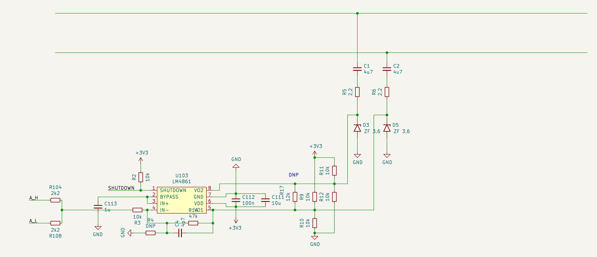
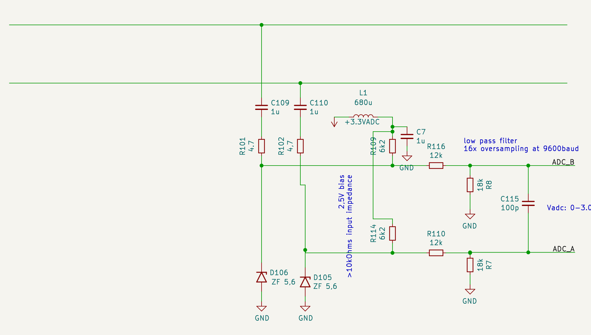

# The analog part

Instead of using the [MAX22088](https://datasheets.maximintegrated.com/en/ds/MAX22088.pdf),
which only ships as QFN package, this project uses a [LM4871](https://www.ti.com/lit/ds/symlink/lm4871.pdf)
as transmitter and a [Raspberry Pi Pico](https://www.raspberrypi.com/products/raspberry-pi-pico/)
as receiver.

*Warning:* Totally overengineered project ahead!

## Ti LM4871 vs STM TS4990

In version `v0.1` and `v0.2` the *Ti LM4871* has been used.

Starting from version `v0.3` the STM TS4990 is being used as
pin-compatible replacement.

See [Ti LM4871 vs STM TS4990](clicks.md) for details.

## The transmitter

The [LM4871](https://www.ti.com/lit/ds/symlink/lm4871.pdf) is and dual
ouput 3W audio amplifier and the circuit around it is following the
design guidelines.
The input is an analog signal generated by a 3 level signal from GPIO
`A_H` and `A_L`. The resulting analog signal has
one of the following levels:
- 3.30V
- 1.65V
- 0.00V

The Z-Diodes `D3` and `D5` protect the device from voltage spikes that
could be introduced on the long P1/P2 lines.

`R5` and `R6` limit the output impedance to more than 4Ohms.

`R11`, `R12`, `R10` and `R9` pull the lines to idle position when the LM4871 is in
shutdown mode. They also provide a minimum load of 10KOhms if the P1/P2 bus is
not connected. **The LM4871 tend to oscillate at several Mhz without a load.
The datasheet recommends 2KOhms as minimum load!**

**`C4` prevents oscillations that can happen if the gain is too small.
Using 4.7pF and a gain of 5 seem to prevent most oscillations.**

The [LM4871](https://www.ti.com/lit/ds/symlink/lm4871.pdf) is able to
drive 0.5Watts at 3.3V.

### Measured results

The [LM4871](https://www.ti.com/lit/ds/symlink/lm4871.pdf) can drive a 3.0V
amplitude signal from a 3.3V supply. Due to the dual-output the generated
differential signal has a level of +/- 3.0V.

## The receiver

The Z-Diodes `D106` and `D105` protect the device from voltage spikes that
could be introduced on the long P1/P2 lines.

`R109`, `R116` and `R8` are providing a bias voltage of 2,5V (when driven by 3.0V ADC voltage)
and they divide the signal amplitude by 1.66.

`R114`, `R110` and `R7` are providing a bias voltage of 2,5V (when driven by 3.0V ADC voltage)
and they divide the signal amplitude by 1.66.

The total impedance of `R109`, `R116`, `R8`, `R114`, `R110` and `R7` is greater than 10KOhms.

`C115` acts a low pass filter.

`ADC_A` and `ADC_B` should be connected to a differential ADC. In this case it's
a RPi pico using ADC0 and ADC1.

### Measured results

The signal has been measured on the Pico ADC behind the AC coupling capacitors and voltage
divider:

The voltage on the ADC has an amplitude of `1.73V`. Mutliplied with the voltage
dividor reciprocal gain this give a `2.87V` amplitude after AC coupling.

When connected to the P1/P2 bus the amplitude is a actually a bit lower: `2.5V`

It is suffcient to be detected by the remote P1/P2 transceiver circuit.
The P1/P2 remote transceiver drives a `5V` amplitude on the bus.