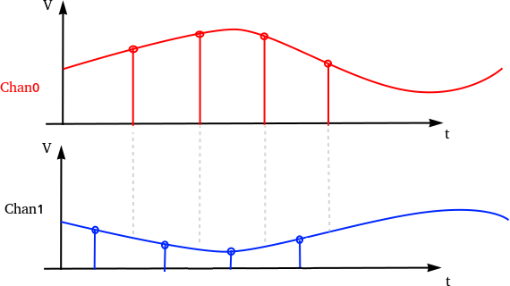
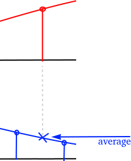
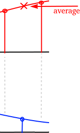

# ADC documentation

The ADC uses two channels to sample the differential P1/P2 bus.
Together with some glue code this emulates a phase correct differential
ADC with a delay of one sample.

## Overview

The P1/P2 differential signal is captured by two ADC channels (Channel0 + Channel1)
in round robin mode.



Channel0 as shown in red and Channel1 as shown in blue is captured in round robin
mode.

To make sure the signal is phase correct the captured data is delayed by one sample.
For every ADC sample the average of the current sample and the last sample of the
same channel is being calculated to get the voltage at sampling the "other" channel.

 


The code makes use of the DMA subsystem and ring buffers to store ADC samples for
later processing.

## The code

```C
	adc_init();

	// Make sure :GPIOs are high-impedance, no pullups etc
	adc_gpio_init(26);
	adc_gpio_init(27);

	// Select ADC input 0 (GPIO26)
	adc_select_input(0);

	adc_fifo_setup(
		true,    // Write each completed conversion to the sample FIFO
		true,    // Enable DMA data request (DREQ)
		1,       // DREQ (and IRQ) asserted when at least 1 sample present
		false,   // We won't see the ERR bit because of 8 bit reads; disable.
		true     // Shift each sample to 8 bits when pushing to FIFO
	);

	adc_set_clkdiv(48000000 / (UART_BAUD_RATE * ADC_OVERSAMPLING_RATE));
	adc_set_round_robin(0x3); // Sample ADC0 + ADC1 in RR
```

Initialize the ADC and the first two channels. Configures the channels in round robin mode.

```C
	// set wrap boundary. This is why we needed alignment!
	channel_config_set_ring(&c, true, 9); // 1 << 9 byte boundary on write ptr

	dma_channel_configure(this->channel2, &c,
		this->data,     // dst
		twos_complement_dma_rx_reg(this->pio, this->sm),  // src
		this->tc,       // transfer count
		true            // start immediately
	);
```
Transfers ADC samples to a ring buffer in SRAM.

```C
	tc_hw = dma_channel_hw_addr(this->channel2)->transfer_count;
	// Compare transfer count with internal shadow register
	if (this->tc == tc_hw)
		return false;

	// Got data!
	this->tc--;
```
The CPU then polls for data availability in the ring buffer by comparing the
transfer_count with the shadow buffer `tc`. If a difference exists the DMA
hardware has transfered more data to the SRAM ring buffer.

