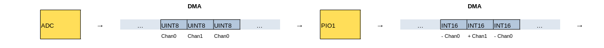

# PIO1 documentation

PIO1 is connected to the DMA and converts the ADC sampled data for easier CPU
processing. This is not necessary, but reduces the CPU load as the summation
of the two ADC phases is essential for a differential ADC and thus is the most
often called routine on the chip.

## Overview

The PIO program reads in 8bit data samples (uint8_t) and creates a 16bit signed output data sample (int16_t).
The first data sample is inverted using the twos complement algorithm.
Every second data sample is not in inverted and just converted to 16bit.

By adding the two signed data samples the differential signal can be calculated.



## The glue code

The PIO programm is loaded into PIO1 SM0 by the code ...

```C
	PIO pio = pio1;
	uint sm = 0;
	uint offset = pio_add_program(this->pio, &twos_complement_program);
	twos_complement_program_init(this->pio, this->sm, offset);
```

... and connected by two DMA channels. The first transfers data from ADC FIFO to the PIO TX FIFO.
```C
		// Get a free channel, panic() if there are none
		channel = dma_claim_unused_channel(true);

		dma_channel_config c = dma_channel_get_default_config(channel);
		// 8 bit transfers
		channel_config_set_transfer_data_size(&c, DMA_SIZE_8);
		//  don't increment read and write address
		channel_config_set_read_increment(&c, false);
		channel_config_set_write_increment(&c, false);

		channel_config_set_high_priority(&c, true);

		// Pace transfers based on availability of ADC samples
		channel_config_set_dreq(&c, DREQ_ADC);

		dma_channel_configure(tchannel, &c,
			twos_complement_dma_tx_reg(pio, sm),  // dst
			&adc_hw->fifo,  // src
			0xffffffff,     // transfer count
			true            // start immediately
		);
```

The second places data from PIO FIFO on some destination:
```C
		// Get a free channel, panic() if there are none
		int channel2 = dma_claim_unused_channel(true);
	
		dma_channel_config c = dma_channel_get_default_config(channel2);
		// 16 bit transfers
		channel_config_set_transfer_data_size(&c, DMA_SIZE_16);

		// increment the write adddress, don't increment read address
		channel_config_set_read_increment(&c, false);
		channel_config_set_write_increment(&c, true);

		// Pace transfers based on availability of PIO samples
		channel_config_set_dreq(&c, pio_get_dreq(pio, sm, false));

		// Set destination .....
```


## The source

The PIO source to create the twos complement. As 8bit input data are provided the data
is converted to 16bit to not lose 1bit precision. Data is shifted out LSB first.

```asm
.program twos_complement

entry:
	; x = 7
	set x, 7
	; Get data from output FIFO
	pull block
```
The program prepares scratch register `x` with the number of iterations and blocks until data arrives in the input FIFO.

```asm
next_0: ; 4 instructions per bit, +1/+2 on last bit
	; Get one bit from OSR
	out y, 1
	; Shift into ISR
	in y, 1
```
Shift LSB from OSR to ISR.

```asm
	; x--
	jmp x-- not_done_yet
	; At this point all bits have been shifted in
	; x = 0xff due to previous decrement
	; if (y > 0) jmp done
	jmp y-- done
	; x = 0
	set x, 0
	; jmp done
	jmp done
not_done_yet:
	; if (y == 0) jmp next_0; else next_invert
	jmp !y next_0
```
Decrement x and test if done. If not done it jumps to `not_done_yet` and continues the loop. If the bit was `1` it does not jump to `next_0`, but continues below.

If done check of the MSB needs to be `0b11111111`or `0b00000000` and jump to `done`.

```asm
; invert remaining bits
	mov osr, ~osr
next_invert: ; 3 instructions per bit, +1 on last bit
	; Get one bit from OSR
	out y, 1
	; Shift into ISR
	in y, 1
	; if (x--) jmp next_invert
	jmp x-- next_invert
	; x = 0xff due to previous decrement
```
Invert the remaining bits in the `OSR` and shift them all from OSR to ISR. Decrement x and test if done.

```asm
done:
	; push high byte
	in x, 8

	; shift in 16 0s
	in null, 16
	; Push to input FIFO
	push block
```
`done` is always entered after 8 bits has been shifted into `ISR`. Shift in the high bytes (they don't care as we only need 16bit).

```asm
	; Get second byte and don't do any modification
	pull block
	out y, 8
	in y, 8
	in null, 24
	push block

	jmp entry
```
The second data sample is not inverted and just converted to 16bit.
